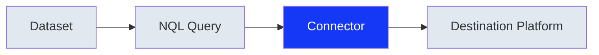

Data activation is the process of delivering audience data from Narrative to external platforms—such as demand-side platforms (DSPs), social networks, and analytics tools—where you can take action on that data. Connectors are the mechanism that make this possible.

## What connectors do

A connector is a pre-built integration that connects Narrative to an external destination. Connectors handle the complexities of delivering data to each platform:

- **Format translation**: Converts your data into the format required by the destination
- **Identity matching**: Maps your identifiers to the platform's identity space
- **API integration**: Manages authentication, rate limits, and delivery protocols
- **Audience management**: Creates and updates audiences or segments in the destination

When you deliver data through a connector, you don't need to build custom integrations or understand each platform's technical requirements. The connector handles all of this automatically.

## How activation works

1. **Prepare your data**: Structure your audience data in one or more [datasets](/concepts/primitives/datasets) with the required identifiers (typically hashed emails or phone numbers)

2. **Normalize with Rosetta Stone**: Map your data fields to [Rosetta Stone](/concepts/rosetta-stone/overview) attributes so the connector knows which fields contain deliverable identifiers

3. **Configure the connector**: Install the connector for your destination and provide the necessary credentials (API keys, account IDs, etc.)

4. **Deliver your audience**: Use NQL to select the records you want to deliver, or deliver entire datasets directly

## Identifier requirements

Each destination requires specific identifier types for matching. Connectors automatically transform your data to meet these requirements, but your source data must include at least one supported identifier type.

| Identifier Type | Common Destinations |
|-----------------|---------------------|
| SHA256 hashed email | Google DV360, Meta, The Trade Desk, TikTok |
| SHA256 hashed phone | Google DV360, Meta, TikTok |
| Mobile advertising ID (MAID) | The Trade Desk, DSPs |
| UID2 | The Trade Desk (auto-generated from email) |

<Note>
If your data lacks these identifiers but you want to activate it as an audience, contact your Narrative account representative for assistance with identity resolution options.
</Note>

For detailed requirements on preparing identifiers, see [Hashing PII for Upload](/guides/ingestion/hashing-pii).

---

## Available destinations

Narrative provides connectors to major advertising and data platforms:

<CardGroup cols={2}>
  <Card title="The Trade Desk" icon="bullhorn" href="/reference/connectors/the-trade-desk">
    Deliver audiences to TTD's first-party or third-party marketplace
  </Card>
  <Card title="Meta" icon="meta" href="/reference/connectors/meta">
    Push custom audiences to Facebook and Instagram
  </Card>
  <Card title="Google DV360" icon="google" href="/reference/connectors/google-dv360">
    Activate audiences in Display & Video 360
  </Card>
  <Card title="Amazon S3" icon="aws" href="/reference/connectors/amazon-s3">
    Deliver data files to your S3 bucket
  </Card>
</CardGroup>

See [Connector Reference](/reference/connectors/index) for the complete list of available connectors.

---

## Activation patterns

There are several ways to structure your data for activation, depending on your use case:

### Single-purpose datasets

Create a separate dataset for each audience you want to activate. This approach is straightforward when you have distinct, pre-defined audiences.

**Best for**: Organizations that build and maintain audiences outside of Narrative, then upload them for delivery.

### Master dataset with audience segments

Maintain a single dataset containing all your audience data, with columns that identify which audience each record belongs to. Use NQL to filter and deliver specific segments.

**Best for**: Organizations managing many audiences that share the same underlying data structure.

### Raw data with dynamic segmentation

Upload your complete customer data with all available attributes, then use NQL to create audiences on-the-fly based on any combination of attributes.

**Best for**: Organizations that want maximum flexibility to create new audiences without re-uploading data.

<Info>
For detailed guidance on implementing these patterns, see [Structuring Audiences for Activation](/guides/activation/audience-strategies).
</Info>

---

## What happens after delivery

When you deliver data through a connector:

1. **The connector processes your data**: Identifiers are formatted and, if needed, translated (e.g., hashed email to UID2)

2. **Data is sent to the destination**: The connector uses the platform's API to create or update audiences

3. **The platform matches identifiers**: The destination matches your identifiers against its user base. Match rates vary by platform and identifier type (typically 30-70%)

4. **Audiences become targetable**: Once processed, your audiences are available for targeting in campaigns on that platform

<Warning>
Match rates depend on the destination platform's user base and your data quality. Not every identifier will match. Monitor your connector delivery reports to understand match rates for your audiences.
</Warning>

---

## Related content

<CardGroup cols={2}>
  <Card title="Structuring Audiences" icon="sitemap" href="/guides/activation/audience-strategies">
    Strategies for organizing data for activation
  </Card>
  <Card title="Data Onboarding" icon="upload" href="/concepts/identifiers/data-onboarding">
    Connect offline data to online identifiers
  </Card>
  <Card title="Hashing PII" icon="hashtag" href="/guides/ingestion/hashing-pii">
    Prepare identifiers for upload and activation
  </Card>
  <Card title="Connector Reference" icon="plug" href="/reference/connectors/index">
    Technical details for each connector
  </Card>
</CardGroup>
