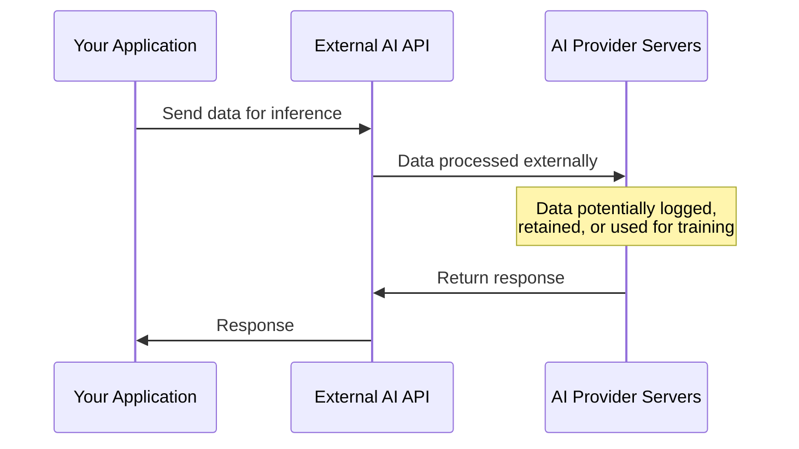
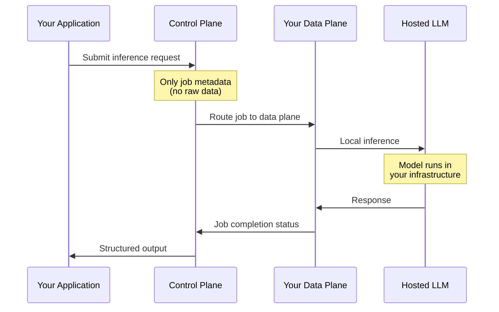

Model Inference is designed with data privacy as a foundational principle. Unlike traditional AI services that require sending data to external providers, Model Inference runs entirely within your [data plane](/concepts/primitives/data-planes), ensuring your data never leaves your controlled infrastructure.

## The privacy challenge with external AI

When using external AI APIs (OpenAI API, Anthropic API, etc.), your data flows to third-party servers:

This creates several concerns:
- **Data residency**: Data leaves your infrastructure and jurisdiction
- **Third-party access**: Provider can potentially access your data
- **Compliance complexity**: Must evaluate provider's data handling practices
- **Retention policies**: Provider may retain data for improvement or debugging

## How Model Inference protects your data

Model Inference eliminates these concerns by hosting models within your data plane:

### Key privacy guarantees

| Aspect | Guarantee |
|--------|-----------|
| **Data location** | Data never leaves your data plane |
| **No external calls** | No network requests to Anthropic, OpenAI, or other providers |
| **Your infrastructure** | Models run on compute within your environment |
| **No provider logging** | AI providers have no access to your data |
| **Full control** | You control data access, retention, and deletion |

## Compliance implications

Model Inference simplifies compliance with data protection regulations:

### GDPR considerations

- **Data minimization**: Only necessary data is processed
- **Storage limitation**: You control retention within your data plane
- **Data transfers**: No cross-border transfers to AI providers
- **Processor agreements**: No need for DPAs with AI providers for inference

### CCPA considerations

- **Service provider status**: AI providers are not service providers for your data
- **Sale of data**: No data is shared with third parties
- **Right to delete**: Full control over data deletion

### Industry regulations

For industries with strict data handling requirements (healthcare, finance, government), Model Inference enables AI capabilities without the compliance burden of external AI services:

- **HIPAA**: PHI never leaves your controlled environment
- **PCI DSS**: Payment data stays within your secure perimeter
- **FedRAMP**: Data remains in authorized boundaries

## Audit trail

All inference jobs are tracked through Narrative's standard job system:

- Job creation timestamp
- Data plane where inference ran
- Model used
- Token usage metrics
- Job completion status

This provides a complete audit trail without exposing the actual data processed.

## What the control plane sees

The [control plane](/concepts/primitives/control-plane) only handles:

- Job routing and coordination
- Metadata about requests (model choice, configuration)
- Job status updates
- Token usage statistics

The control plane never receives or processes:
- Your prompt content
- Your data
- The model's responses

## Comparison with external AI

| Aspect | External AI APIs | Model Inference |
|--------|------------------|-----------------|
| Data location | Provider's servers | Your data plane |
| Network traffic | Data sent externally | Local only |
| Provider data access | Yes (per their policies) | No |
| Compliance burden | High (must evaluate provider) | Low (your infrastructure) |
| Audit complexity | Must rely on provider logs | Full control |
| Data retention | Provider-controlled | You control |

## Best practices

1. **Use appropriate models**: Don't send more context than necessary
2. **Review prompts**: Ensure prompts don't unnecessarily include sensitive data
3. **Monitor usage**: Track inference jobs through the job system
4. **Set retention policies**: Configure data plane retention appropriately

## Related content

<CardGroup cols={2}>
  <Card title="Model Inference Overview" icon="brain" href="/concepts/model-inference/overview">
    How Model Inference works
  </Card>
  <Card title="Data Planes" icon="database" href="/concepts/primitives/data-planes">
    Understanding data plane architecture
  </Card>
  <Card title="Security Model" icon="lock" href="/concepts/architecture/security-model">
    Platform security architecture
  </Card>
  <Card title="GDPR" icon="shield" href="/concepts/compliance/gdpr">
    GDPR compliance
  </Card>
</CardGroup>
