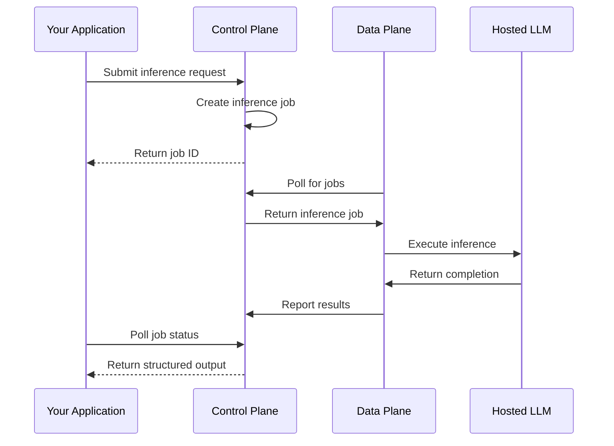

Model Inference enables you to run large language model (LLM) operations directly within your [data plane](/concepts/primitives/data-planes). Unlike traditional AI APIs that require sending data to external services, Model Inference keeps your data secure within your own infrastructure while still leveraging powerful AI capabilities.

## Why Model Inference matters

When working with sensitive data, sending it to external AI services creates compliance and security risks. Model Inference solves this by hosting models within your data plane infrastructure:

| Traditional AI APIs | Model Inference |
|---------------------|-----------------|
| Data sent to external servers | Data stays in your infrastructure |
| Subject to third-party data policies | You control data residency |
| Network latency to external services | Local execution within data plane |
| Compliance complexity | Simplified compliance posture |

This architecture enables AI-powered features—like auto-generating dataset descriptions or translating natural language to technical formats—without compromising your data governance.

## How Model Inference works

Model Inference operates through Narrative's [job queue](/reference/glossary#job-queue), following the same pattern as other asynchronous operations:

1. **Submit request**: Your application sends an inference request specifying the model, messages, and output schema
2. **Job creation**: The [control plane](/concepts/primitives/control-plane) creates an inference job and queues it
3. **Local execution**: The data plane [operator](/reference/glossary#operator-data-plane) picks up the job and runs inference locally
4. **Structured response**: Results are returned in a predictable format defined by your JSON Schema



## Key capabilities

### Supported models

Model Inference supports models from multiple providers, all hosted within your data plane:

| Provider | Models |
|----------|--------|
| Anthropic | Claude Haiku 4.5, Claude Sonnet 4.5, Claude Opus 4.5 |
| OpenAI | GPT-4.1, o4-mini, GPT-oss-120b |

For detailed model specifications, see the official documentation from [Anthropic](https://docs.anthropic.com/en/docs/about-claude/models) and [OpenAI](https://platform.openai.com/docs/models).

### Structured output

Every inference request includes a JSON Schema that defines the expected response format. The model is constrained to return valid JSON matching your schema, making responses predictable and easy to parse programmatically.

```typescript
const inferenceConfig = {
  output_format_schema: {
    type: 'object',
    properties: {
      summary: { type: 'string' },
      confidence: { type: 'number', minimum: 0, maximum: 1 },
      categories: {
        type: 'array',
        items: { type: 'string' }
      }
    },
    required: ['summary', 'confidence']
  }
};
```

This guarantees you receive a response with exactly the fields you expect, in the types you specify.

### Conversation context

Inference requests support multi-turn conversations through the messages array. Each message has a role (`system`, `user`, or `assistant`) and text content:

```typescript
const messages = [
  { role: 'system', text: 'You are a data classification assistant.' },
  { role: 'user', text: 'Classify this dataset based on its columns...' }
];
```

### Configuration options

Fine-tune model behavior with inference configuration parameters:

| Parameter | Description | Default |
|-----------|-------------|---------|
| `max_tokens` | Maximum tokens in the response | Model default |
| `temperature` | Randomness (0 = deterministic, 1 = creative) | Model default |
| `top_p` | Nucleus sampling parameter | Model default |
| `stop_sequences` | Strings that stop generation | None |

## Common use cases

Model Inference powers AI features throughout the Narrative platform:

- **Dataset descriptions**: Automatically generate human-readable descriptions from dataset metadata and samples
- **Schedule translation**: Convert natural language schedules ("every weekday at 9am") to CRON expressions
- **Data classification**: Categorize records based on content analysis
- **Schema suggestions**: Recommend Rosetta Stone attribute mappings based on column names and sample data

## Data privacy

Because inference runs within your data plane:

- **No external API calls**: Data is never sent to Anthropic, OpenAI, or any external service
- **Your infrastructure**: Models run on compute resources within your data plane
- **Compliance-friendly**: Simplifies GDPR, CCPA, and other regulatory requirements
- **Audit trail**: All inference jobs are logged through the standard job system

For more details, see [Data Privacy in Model Inference](/concepts/model-inference/data-privacy).

## Related content

<CardGroup cols={2}>
  <Card title="Running Model Inference" icon="play" href="/guides/sdk/running-model-inference">
    Submit inference requests using the SDK
  </Card>
  <Card title="Structured Output" icon="brackets-curly" href="/concepts/model-inference/structured-output">
    How JSON Schema ensures predictable responses
  </Card>
  <Card title="Supported Models" icon="microchip" href="/reference/model-inference/supported-models">
    Available models and their capabilities
  </Card>
  <Card title="Data Privacy" icon="shield" href="/concepts/model-inference/data-privacy">
    How inference keeps data secure
  </Card>
</CardGroup>
